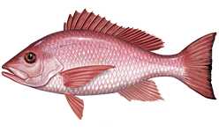

# Snapper



## A Web microservice for capturing a website's OpenGraph data built in Golang

## Building Snapper

building the binary
```bash
git clone https://github.com/owl-93/snapper
cd snapper
go build .
```

optionally give the executable a name
```bash
go build -o <executable name> .
```

## Running Snapper
```bash
./snapper
```

### Specifying a different port
you can tell snapper to use a different port by passing the port as a comman line argument
```bash
./snapper 8081
```


By default, snapper runs on port 8888
## Using Snapper
To snap a webpage's Opengraph metadata, just make a REST GET request to / with
the target website specified using the query parameter `site`

## Example
```bash
curl http://localhost:8888/?site=https://code.visualstudio.com/download
```

Response

```json
[
    {
        "name": "og:title",
        "value": "Download Visual Studio Code - Mac, Linux, Windows"
    },
    {
        "name": "og:description",
        "value": "Visual Studio Code is free and available on your favorite platform - Linux, macOS, and Windows.  Download Visual Studio Code to experience a redefined code editor,  optimized for building and debugging modern web and cloud applications."
    },
    {
        "name": "og:image",
        "value": "https://code.visualstudio.com/opengraphimg/opengraph-home.png"
    },
    {
        "name": "og:url",
        "value": "https://code.visualstudio.com/Download"
    }
]
```